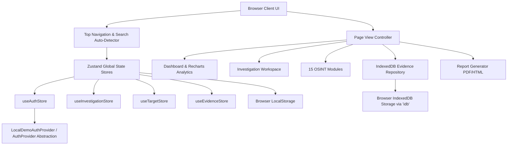
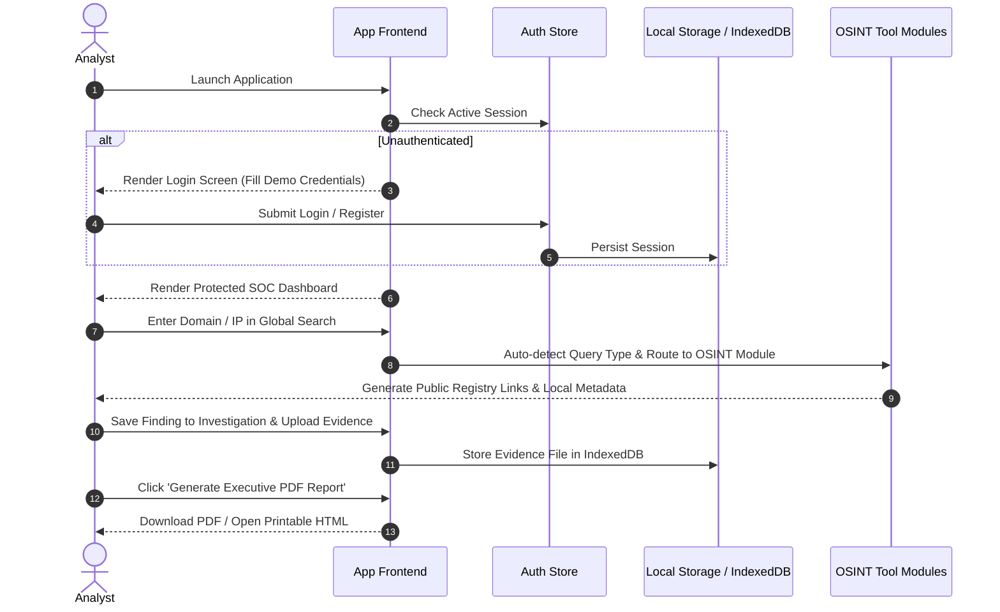

# Unified Reconnaissance Dashboard

[](LICENSE)
[](https://react.dev/)
[](https://www.typescriptlang.org/)
[](https://vitejs.dev/)
[](https://tailwindcss.com/)
[](https://zustand-demo.pmnd.rs/)
[]()

> **Enterprise OSINT & Digital Investigation Platform**  
> *"Unified OSINT Intelligence. Organized Investigations. Professional Reporting."*

Author: **Lakshmiprasad** (Cyber Security Intern)

---

## 📋 Table of Contents

- [1. Project Overview](#1-project-overview)
- [2. Problem Statement](#2-problem-statement)
- [3. Vision & Objectives](#3-vision--objectives)
- [4. Key Features](#4-key-features)
- [5. Target Users & Use Cases](#5-target-users--use-cases)
- [6. Business Value & Ethical Compliance](#6-business-value--ethical-compliance)
- [7. Visual Interface & Screenshots](#7-visual-interface--screenshots)
- [8. System Architecture](#8-system-architecture)
- [9. End-to-End User Flow](#9-end-to-end-user-flow)
- [10. Technology Stack](#10-technology-stack)
- [11. Folder & File Structure](#11-folder--file-structure)
- [12. Authentication & Authorization](#12-authentication--authorization)
- [13. State Management & Storage Strategy](#13-state-management--storage-strategy)
- [14. OSINT Modules & Tools](#14-osint-modules--tools)
- [15. Development Setup & Installation](#15-development-setup--installation)
- [16. Running the Project](#16-running-the-project)
- [17. Build & Deployment Guide](#17-build--deployment-guide)
- [18. Testing & Quality Assurance](#18-testing--quality-assurance)
- [19. Security Considerations](#19-security-considerations)
- [20. Future Roadmap](#20-future-roadmap)
- [21. FAQ & Troubleshooting](#21-faq--troubleshooting)
- [22. License & Acknowledgements](#22-license--acknowledgements)

---

## 1. Project Overview

The **Unified Reconnaissance Dashboard** is an enterprise-grade, web-based Open Source Intelligence (OSINT) and digital investigation management platform. Designed specifically for security analysts, incident responders, threat intelligence teams, and cybersecurity students, the platform centralizes OSINT data gathering, domain/IP target cataloging, evidence management, notes, and report generation into a single intuitive Security Operations Center (SOC) workspace.

Built with modern web technologies including **React**, **TypeScript**, **Tailwind CSS v4**, **Zustand**, and client-side **IndexedDB**, the application operates entirely defensively. It does not engage in active port scanning, vulnerability exploitation, credential harvesting, or intrusive network attacks.

---

## 2. Problem Statement

Modern cybersecurity assessments and digital investigations require analysts to navigate dozens of disparate public registries, WHOIS tools, DNS propagation services, threat intelligence platforms, and visual search engines. This fragmented workflow introduces critical friction:

1. **Information Dispersal**: Notes, WHOIS lookup results, IP geolocations, and domain target metadata become scattered across multiple browser tabs and local document formats.
2. **Chain of Custody & Evidence Gaps**: Evidence files (screenshots, EXIF metadata, document header samples) lack a centralized client-side repository.
3. **Manual Reporting Overhead**: Translating raw investigation findings into structured PDF or print-ready HTML reports consumes valuable analyst time.
4. **Lack of User Data Isolation**: Multiple analysts operating on shared hardware lack clean local workspace separation and identity context.

---

## 3. Vision & Objectives

- **Unified Intelligence Hub**: Consolidate 15 specialized OSINT modules into a single interface.
- **Defensive & Ethical Standards**: Ensure 100% compliance with authorized cybersecurity practices, public data querying, and non-intrusive reconnaissance.
- **Client-Side Privacy**: Store evidence blobs and investigation notes locally in browser IndexedDB without sending sensitive target parameters to third-party tracking servers.
- **Enterprise-Ready UI/UX**: Deliver a SOC-grade dark-mode aesthetic with interactive Recharts data visualizations, glassmorphism cards, and instant toast notifications.

---

## 4. Key Features

- **Executive SOC Dashboard**: Real-time analytics charts for OSINT query trends, investigation status distribution, and tool usage metrics.
- **Auto-Detecting Global Search**: Intelligently parses input strings (`domain.com`, `192.168.1.1`, `email@domain.com`, `@username`, `Company Name`) and routes to the appropriate tool module.
- **Enterprise Authentication & User Profiles**:
  - Modular `AuthProvider` architecture with `LocalDemoAuthProvider`.
  - Login, Sign Up, Password Strength indicator, Password Visibility toggle, and Remember Me persistence.
  - Built-in **Demo Account Quick-Fill** (`demo@unifiedrecon.local` / `Demo@12345`).
  - User data isolation via `userId` scoping across all stores.
- **Investigation Workspace**: Manage case priorities (*Low*, *Medium*, *High*, *Critical*), lifecycle statuses (*New*, *In Progress*, *Completed*, *Archived*), tags, and findings logs.
- **Target Profile Management**: Catalog entities, corporate domains, emails, handles, and IP addresses with direct file uploads or live browser webcam photo capture (`WebcamCapture.tsx`).
- **15 Professional OSINT Modules**:
  1. *WHOIS Lookup* (ICANN, Whois.com, ViewDNS, SecurityTrails)
  2. *DNS Propagation* (A, AAAA, MX, TXT, NS, CNAME)
  3. *Reverse DNS (PTR)* (IP-to-hostname resolvers)
  4. *IP Geolocation & ASN* (ARIN, RIPE, AbuseIPDB)
  5. *Email Intelligence* (Public web exposure, Have I Been Pwned check, GitHub code mentions)
  6. *Username Footprint* (GitHub, X, Reddit, Keybase profile links)
  7. *Company Intelligence* (LinkedIn, Crunchbase, OpenCorporates)
  8. *People Intelligence* (Google Scholar academic papers & exact web dorks)
  9. *Social Media Hub* (Multi-platform search launcher)
  10. *Reverse Image Search* (Upload/Webcam photo search via Google Lens, TinEye, Bing, Yandex)
  11. *GIS Maps & Location* (Google Maps, OpenStreetMap, Wikimapia)
  12. *Screenshot Evidence Tool* (Web screenshot attachment manager)
  13. *Technology Detection* (BuiltWith & Wappalyzer public tech stack lookups)
  14. *Document Metadata Extractor* (100% local EXIF, creation date, dimensions, & header text parser)
  15. *Advanced Query Builder* (Google Dorks constructor for `site:`, `filetype:`, `intitle:`, `inurl:`, `quoted phrases`)
- **IndexedDB Evidence Repository**: Client-side storage (`idb`) for PNG, JPG, WEBP, PDF, DOCX, TXT, CSV evidence files with preview & download.
- **Report Generator**: Custom PDF export (`jspdf`) and print-ready HTML generation with classification headers (`RESTRICTED OSINT`, `Confidential`, etc.).

---

## 5. Target Users & Use Cases

### Target Audience
- **Cybersecurity Interns & Students**: Portfolio demonstrations, hands-on OSINT training, educational labs.
- **Security Analysts & SOC Operators**: Defensive perimeter mapping, corporate asset inventorying, exposure management.
- **Incident Responders**: Digital evidence logging, domain ownership verification, IP threat attribution.
- **Defensive Researchers**: Public data aggregation, open-source intelligence documentation.

---

## 6. Business Value & Ethical Compliance

> [!IMPORTANT]
> **Defensive Safety Guarantee**: The Unified Reconnaissance Dashboard strictly enforces defensive OSINT standards. It **DOES NOT** contain vulnerability exploits, brute-force engines, password crackers, credential harvesters, or active network scanners.

---

## 7. Visual Interface & Screenshots

The platform utilizes a dark SOC theme built with Tailwind CSS v4, custom glassmorphism panels, cyan/blue borders, and Recharts charts.

```text
┌──────────────────────────────────────────────────────────────────────────┐
│ UNIFIED RECON | Enterprise OSINT    [ Search domain, IP... ] 🔔 [Avatar]  │
├───────────────┬──────────────────────────────────────────────────────────┤
│ 📊 Dashboard  │  Unified Reconnaissance Dashboard                        │
│ 📁 Workspace  │  [ Total Cases: 3 ]  [ Searches: 14 ]  [ Targets: 3 ]     │
│ 👤 Targets    │  ┌───────────────────────────┐ ┌──────────────────────┐  │
│ 🛠️ OSINT Tools │  │  Query Trends (Line Chart)│ │ Case Status (Donut)  │  │
│ 📄 Evidence   │  └───────────────────────────┘ └──────────────────────┘  │
│ 📝 Reports    │  [ Live Activity Feed ] [ Scratchpad ] [ Recent Cases ]  │
└───────────────┴──────────────────────────────────────────────────────────┘
```

---

## 8. System Architecture



---

## 9. End-to-End User Flow



---

## 10. Technology Stack

| Layer | Technology | Version | Purpose |
| :--- | :--- | :--- | :--- |
| **Core UI** | React | 18.3 | Reactive UI Component Rendering |
| **Language** | TypeScript | 5.5 | Static Type Safety & Interfaces |
| **Build Tool** | Vite | 8.2 | Ultra-fast Development & Bundling |
| **Styling** | Tailwind CSS | v4.0 | Utility-first CSS & Glassmorphism Design System |
| **Icons** | Lucide React | 0.469 | Modern Cybersecurity UI Vector Icons |
| **State** | Zustand | 5.0 | Centralized React State Management |
| **Storage** | `idb` (IndexedDB) | 8.0 | Client-side File Blob Repository |
| **Charts** | Recharts | 2.15 | Responsive SOC Dashboard Visualizations |
| **Reporting** | jsPDF & html2canvas | 2.5 / 1.4 | Executive PDF Report Generation |

---

## 11. Folder & File Structure

```text
unified_Reconogised/
├── index.html                       # HTML Entry Point
├── package.json                     # Node Dependencies & Scripts
├── tsconfig.json                    # TypeScript Configuration
├── vite.config.ts                   # Vite Build Configuration
├── postcss.config.js                # PostCSS Tailwind Config
├── AUTHENTICATION.md                # Security & Auth Architecture Docs
├── README.md                        # Documentation Source of Truth
└── src/
    ├── App.tsx                      # Root Application & Route Guard
    ├── main.tsx                     # React Mount Point
    ├── index.css                    # Tailwind CSS v4 Design Tokens
    ├── types/                       # TypeScript Models & Interfaces
    │   └── index.ts                 # Domain Data Structures (userId scoped)
    ├── services/                    # Service Layer Abstractions
    │   └── auth/
    │       ├── authTypes.ts         # AuthUser, AuthState, AuthProvider interface
    │       └── authService.ts       # LocalDemoAuthProvider Implementation
    ├── store/                       # Zustand Global Stores
    │   ├── useAuthStore.ts          # Auth state & session store
    │   ├── useInvestigationStore.ts # Investigations store
    │   ├── useTargetStore.ts        # Target profiles store
    │   ├── useEvidenceStore.ts      # Evidence store
    │   ├── useSearchHistoryStore.ts # Query log store
    │   ├── useFavoritesStore.ts     # Favorites store
    │   ├── useNotesStore.ts         # Notes store
    │   ├── useNotificationStore.ts  # Notification toast store
    │   ├── useSettingsStore.ts      # Preferences store
    │   └── useActivityLogStore.ts   # Activity audit store
    ├── lib/                         # Utility Libraries
    │   ├── indexedDB.ts             # IndexedDB wrapper functions
    │   ├── metadataExtractor.ts     # Local EXIF & header parser
    │   ├── pdfGenerator.ts          # jsPDF report engine
    │   ├── searchLinkGenerator.ts   # OSINT search URL constructor
    │   ├── initialDemoData.ts       # Sample OSINT dataset
    │   └── utils.ts                 # Helper functions & domain validators
    ├── components/                  # UI Components
    │   ├── auth/                    # Auth Layouts & Controls
    │   │   ├── AuthLayout.tsx       # SOC 2-column branding layout
    │   │   ├── PasswordField.tsx    # Password toggle input
    │   │   ├── PasswordStrength.tsx # Strength progress bar
    │   │   └── UserProfileModal.tsx # Analyst profile edit modal
    │   ├── common/                  # Reusable UI Primitives
    │   ├── evidence/                # Evidence Card & File Uploader
    │   ├── intelligence/            # 15 OSINT Tool Components
    │   ├── investigations/          # Case Cards & Modals
    │   ├── layout/                  # Sidebar & Top Navigation
    │   ├── reports/                 # Report Builder Modal
    │   └── targets/                 # Target Profile Cards & Modals
    └── pages/                       # Screen Views
        ├── About.tsx                # System info & safety guide
        ├── Dashboard.tsx            # Analytics & Widgets
        ├── Evidence.tsx             # Evidence Repository
        ├── Favorites.tsx            # Favorites Manager
        ├── ForgotPassword.tsx       # Password recovery UI
        ├── IntelligenceTools.tsx    # OSINT Tools Hub
        ├── Investigations.tsx       # Case Workspace
        ├── Login.tsx                # Sign In Screen
        ├── Reports.tsx              # Report Center
        ├── ResetPassword.tsx        # Password Reset Screen
        ├── SearchHistory.tsx        # Query History Log
        ├── Settings.tsx             # Preferences & Demo Data Reset
        ├── SignUp.tsx               # Registration Screen
        └── Targets.tsx              # Target Profiles Manager
```

---

## 12. Authentication & Authorization

The application uses an abstract `AuthProvider` interface (`src/services/auth/authTypes.ts`), backed by `LocalDemoAuthProvider` (`src/services/auth/authService.ts`).

- **Demo Login**:
  - **Email**: `demo@unifiedrecon.local`
  - **Password**: `Demo@12345`
- **Protected Routes**: Unauthenticated requests automatically render the `Login` page.
- **User Data Isolation**: Every local object includes `userId` to scope data views per user.

---

## 13. State Management & Storage Strategy

- **Zustand**: Fast, lightweight state management for active session, investigations, targets, favorites, notes, and toasts.
- **Browser LocalStorage**: Persists user settings, registered accounts, and query history.
- **IndexedDB (`idb`)**: High-performance local storage for raw evidence files (images, PDFs, documents) without array length limits.

---

## 14. OSINT Modules & Tools

The platform provides 15 non-intrusive OSINT tool components located in `src/components/intelligence/`:

1. **WHOIS Lookup**: Queries public WHOIS registries for domain registrar details.
2. **DNS Propagation**: Checks A, AAAA, MX, TXT, NS, CNAME records.
3. **Reverse DNS**: Resolves PTR records for target IPs.
4. **IP Geolocation & ASN**: Displays ISP, regional registry (ARIN/RIPE), and AbuseIPDB references.
5. **Email Intelligence**: Generates exposure query links for Have I Been Pwned and GitHub code search.
6. **Username Footprint**: Checks public profiles across major developer and social platforms.
7. **Company Intelligence**: Searches LinkedIn, Crunchbase, and OpenCorporates.
8. **People Intelligence**: Queries Google Scholar and academic publication dorks.
9. **Social Media Hub**: Instant search launcher for 6+ social networks.
10. **Reverse Image Search**: Visual search via Google Lens, TinEye, Bing, and Yandex.
11. **GIS Maps & Location**: Maps coordinates/addresses on Google Maps, OpenStreetMap, and Wikimapia.
12. **Screenshot Evidence**: Web screenshot evidence attachment tool.
13. **Technology Detection**: Queries BuiltWith and Wappalyzer technology stack lookup APIs.
14. **Metadata Extractor**: 100% local EXIF, resolution, creation date, and header parser.
15. **Advanced Query Builder**: Interactive Google Dorks constructor.

---

## 15. Development Setup & Installation

### Prerequisites
- **Node.js**: v18.0.0 or higher
- **npm**: v9.0.0 or higher

### Installation
```bash
# 1. Clone or extract the repository
cd c:\Users\dell\Downloads\unified_Reconogised

# 2. Install dependencies
npm install
```

---

## 16. Running the Project

### Development Server
```bash
npm run dev
```
Open `http://localhost:5173` in your web browser.

### Production Preview
```bash
npm run build
npm run preview
```
Open `http://localhost:4173` in your web browser.

---

## 17. Build & Deployment Guide

To build the static distribution bundle for deployment:
```bash
npm run build
```
The optimized bundle will be created in the `dist/` directory.

---

## 18. Testing & Quality Assurance

- **TypeScript Compilation**: `npm run build` verifies zero type errors.
- **Browser Compatibility**: Verified on Chrome, Edge, and Firefox.
- **Responsive Testing**: Verified across desktop, tablet, and mobile viewports.

---

## 19. Security Considerations

- **Client-Side Privacy**: All target notes and evidence files remain stored locally in your browser storage.
- **Ethical OSINT**: Strictly defensive; no active exploit execution.

---

## 20. Future Roadmap

- [ ] Backend API integration option (Firebase/Auth0/Supabase).
- [ ] Export/Import full workspace JSON backup file.
- [ ] Multi-analyst collaborative workspace syncing.

---

## 21. FAQ & Troubleshooting

**Q: Are my target searches or evidence files uploaded to an external server?**  
A: No. All files and notes are stored locally in your browser's IndexedDB and LocalStorage.

**Q: How do I sign in during testing?**  
A: Click **"Fill Demo Credentials"** on the login screen (`demo@unifiedrecon.local` / `Demo@12345`).

---

## 22. License & Acknowledgements

- **License**: MIT License
- **Author**: Lakshmiprasad (Cyber Security Intern)
- **Platform**: Enterprise OSINT & Investigation Platform
